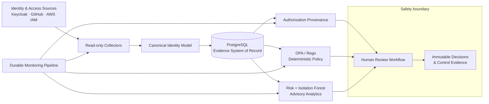

<div align="center">

# Athena

### Continuous Authorization Provenance & Identity Governance

**See who has access, understand why, detect when it no longer makes sense, and preserve the evidence.**

[](https://github.com/Samuelabhinav37/Athena-/actions/workflows/security-gate.yml)
[](https://www.python.org/)
[](https://fastapi.tiangolo.com/)
[](https://www.openpolicyagent.org/)
[](LICENSE)

[Architecture](docs/architecture.md) · [Quick Start](#quick-start) · [Demo](#end-to-end-demo) · [API](#api-evidence) · [Project Journal](docs/project-journal.md)

</div>

---

## The Five Questions

Athena is an open-source identity-governance platform built to answer five questions for every identity:

> **Who are you? What can you access? Why can you access it? Are you still supposed to have it? Can we prove that to an auditor?**

It normalizes identity and entitlement data, reconstructs authorization lineage, evaluates policy as code, detects access drift, coordinates human review, and continuously produces audit-ready evidence.

> **The LLM explains. ML recommends. The policy engine decides. A human approves destructive actions.**

## Business Scenario

Alice begins as a developer and later transfers to the Security team. Her identity changes—but several developer permissions remain active.

Athena traces those permissions to their source, identifies stale and peer-deviating access, evaluates deterministic controls, calculates explainable risk, opens a human review, and proves that a `revoke` decision does **not** silently remove access before an authorized executor exists.

```text
Alice: Developer → Security Analyst

Expected access     Security tools, SIEM, security logs
Retained access     GitHub write, Development DB, Production DB
Athena outcome      Explain → Evaluate → Score → Review → Preserve evidence
```

## Architecture



## What Athena Does Today

| Capability | Delivered behavior |
|---|---|
| Identity ingestion | Keycloak, GitHub organization, and AWS IAM authorization data |
| Authorization provenance | Ordered explanation of how an identity received each effective permission |
| Governance detection | Missing approval, business justification, expiration, and incomplete lineage |
| Policy as code | Deterministic OPA/Rego allow and deny decisions with versioned evidence |
| Identity drift | Controlled role-transition history and retained-access detection |
| Explainable risk | Seven weighted access-decay factors with per-entitlement findings |
| Peer analytics | Governed cohorts, fixed-seed Isolation Forest, drift and false-positive metrics |
| Human remediation | Owned reviews with immutable `retain`, `revoke`, `extend`, or `exception` decisions |
| Continuous monitoring | Idempotent, retryable pipeline with immutable per-step evidence |
| Compliance evidence | Automated mappings for NIST SP 800-53 AC-2, AC-5, and AC-6 |

## Authorization Provenance

Athena’s defining capability is answering **why** effective access exists.

```text
Alice
  ↓ assigned role / member of / reported effective permission
Developer or GitHub Team
  ↓ grants
Repository Write
  ↓ applies to
Athena Repository
```

Every entitlement can carry its source, approval, justification, policy reference, grant time, expiration, governance gaps, and ordered relationship chain.

GitHub’s API reports the highest calculated repository role but not always the exact contributing direct, team, organization, or enterprise grant. Athena records this honestly as `reported_effective_permission` with incomplete lineage instead of inventing a direct grant.

## Security Decision Model

```text
Detect → Explain → Recommend → Human reviews → Authorized executor acts
```

- OPA decisions are deterministic and versioned.
- ML output is advisory and cannot grant, deny, or revoke access.
- Human decisions are append-only evidence.
- Destructive decisions remain `pending` until a separately authorized connector performs and verifies the change.
- Collector credentials are read-only and secrets are never returned by status APIs.
- API access tokens are validated for signature, issuer, audience, expiry, and fixed `RS256` use.
- Review actors come from the authenticated token and cannot be supplied in request payloads.

## Quick Start

### Prerequisites

- Docker with Docker Compose
- Python 3.12+

### 1. Start the identity lab

```bash
docker compose up -d postgres keycloak opa
```

The version-controlled Acme Corp realm is imported automatically. See the [Keycloak lab guide](infra/keycloak/README.md) for seeded identities and local credentials.

### 2. Install Athena

```bash
python -m venv .venv
python -m pip install -e ".[dev]"
alembic upgrade head
```

### 3. Start the API

```bash
uvicorn athena.main:app --reload --app-dir apps/api/src
```

Open:

- Health: `http://localhost:8000/health`
- Readiness: `http://localhost:8000/ready`
- OpenAPI: `http://localhost:8000/docs`

Health and readiness are public. All `/v1` evidence and workflow endpoints require a Keycloak access
token for the `athena-api` audience. See [authentication and API roles](docs/authentication.md).

## End-to-End Demo

Run the complete Alice identity-drift story:

```bash
python -m athena.cli sync-keycloak
python -m athena.cli seed-provenance-demo
python -m athena.cli evaluate-policies --username alice
python -m athena.cli apply-drift-demo
python -m athena.cli assess-risk --username alice
python -m athena.cli run-peer-anomaly --username alice
python -m athena.cli open-review --username alice --actor athena-risk-engine --due-days 7
```

Run the durable monitoring pipeline:

```bash
python -m athena.cli monitor-once \
  --username alice \
  --schedule-key manual:demo
```

Reusing the same completed schedule key is an idempotent no-op.

Run the CI-equivalent security gate:

```bash
python -m athena.cli security-gate \
  --output-directory artifacts/security-gate
```

## GitHub Connector

Configure a least-privilege, read-only token in your local `.env`:

```dotenv
ATHENA_GITHUB_ORG=your-organization
ATHENA_GITHUB_TOKEN=your-read-only-token
```

Then synchronize organization members, teams, repositories, and effective repository permissions:

```bash
python -m athena.cli sync-github
```

The connector uses API-version headers, pagination, ETags, cached checkpoints, content fingerprints, and revocation detection. Never commit `.env` or production credentials.

## AWS IAM Connector

Athena uses the standard AWS credential chain, so credentials stay in AWS-supported environment,
profile, workload-role, or instance-role providers. Configure an optional profile and region:

```dotenv
ATHENA_AWS_PROFILE=athena-read-only
ATHENA_AWS_REGION=us-east-1
ATHENA_AWS_ENABLED=true
```

Run a read-only synchronization:

```bash
python -m athena.cli sync-aws-iam
```

The connector collects users, groups, roles, role trust policies, managed and inline policies, and
access-key status and age. It normalizes Allow actions over AWS resource patterns, detects removed
grants, and skips unchanged snapshots. See the [AWS IAM connector guide](docs/aws-iam.md) for the
minimum collector policy and authorization limitations.

## API Evidence

| Endpoint | Evidence |
|---|---|
| `GET /v1/identities` | Normalized identity inventory |
| `GET /v1/identities/{id}/entitlements` | Effective access and ordered provenance |
| `GET /v1/identities/{id}/policy-evaluations` | Versioned OPA inputs, decisions, and violations |
| `GET /v1/identities/{id}/risk-assessments` | Explainable access-decay scores and findings |
| `GET /v1/identities/{id}/anomaly-assessments` | Model, cohort, drift, score, and explanation evidence |
| `GET /v1/reviews` | Human remediation cases and immutable decision history |
| `GET /v1/monitoring/runs` | Scheduled pipeline attempts and ordered step evidence |
| `GET /v1/connectors` | Sanitized connector checkpoints without cached payloads |
| `GET /v1/auth/me` | Validated caller identity and Athena roles |

## Evidence-Driven Engineering

Athena treats evidence as a product feature, not an afterthought.

- Python tests, Rego tests, migrations, schema-drift checks, and control mappings run in CI.
- Policy changes are evaluated against required allow and deny fixtures.
- Audit events, policy evaluations, role transitions, risk assessments, anomaly runs, review events, and monitoring steps are protected by append-only or immutable controls.
- The [project journal](docs/project-journal.md) records milestones, architectural decisions, failures, fixes, validation results, commits, and hosted workflow runs.

## Repository Map

```text
Athena/
├── apps/api/              FastAPI backend, collectors, services, and CLI
├── apps/web/              React dashboard workspace (planned)
├── controls/              Machine-readable NIST control mappings
├── docs/                  Architecture, decisions, and project journal
├── infra/keycloak/        Reproducible Acme Corp identity lab
├── migrations/            Versioned PostgreSQL schema
├── policies/              OPA/Rego rules, tests, and fixtures
├── tests/                 Unit, integration, security, and acceptance tests
└── compose.yaml           Local PostgreSQL, Keycloak, and OPA stack
```

## Roadmap

- [x] Controlled Keycloak identity lab
- [x] Canonical identity and entitlement model
- [x] Authorization provenance
- [x] OPA policy enforcement and CI security gate
- [x] Identity drift and explainable access-decay scoring
- [x] Governed peer anomaly analytics
- [x] Human remediation workflow
- [x] Durable continuous monitoring
- [x] Incremental GitHub authorization connector
- [x] Incremental AWS IAM authorization connector
- [x] Athena OIDC token validation and role-based API authorization
- [ ] React identity, risk, review, and audit dashboard
- [ ] Local Ollama explanations
- [ ] Neo4j identity attack-path analysis

## Documentation

- [Architecture and trust boundaries](docs/architecture.md)
- [Complete project journal](docs/project-journal.md)
- [Branch protection recommendations](docs/branch-protection.md)
- [Keycloak identity lab](infra/keycloak/README.md)
- [AWS IAM connector](docs/aws-iam.md)
- [OIDC authentication and API roles](docs/authentication.md)
- [Contribution guide](CONTRIBUTING.md)
- [Security policy](SECURITY.md)

## Contributing

Contributions are welcome. Read [CONTRIBUTING.md](CONTRIBUTING.md) before opening a change. Please report suspected vulnerabilities privately using [SECURITY.md](SECURITY.md), not through a public issue.

## License

Licensed under the [Apache License 2.0](LICENSE).
