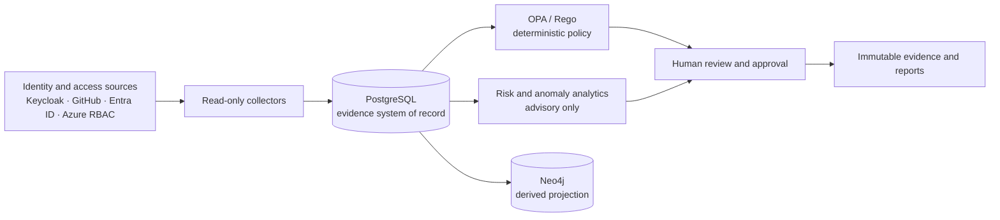

<div align="center">

# Athena

### Continuous authorization provenance and identity governance

Understand who has access, why they have it, whether it remains appropriate, and how to prove it.

[](https://github.com/Samuelabhinav37/Athena/actions/workflows/security-gate.yml)
[](https://github.com/Samuelabhinav37/Athena/actions/workflows/supply-chain.yml)
[](https://www.python.org/)
[](LICENSE)

[Getting started](#getting-started) · [Architecture](#architecture) · [Security](#security-model) · [Documentation](#documentation) · [Contributing](CONTRIBUTING.md)

</div>

> [!IMPORTANT]
> Athena is pre-release software. The repository controls are implementation-ready, but production
> deployment remains blocked until the recovery, residency, scaling, and operational evidence in
> the [readiness manifest](governance/readiness.json) is complete.

## Overview

Athena is an open-source identity-governance platform for reconstructing authorization lineage and
producing audit-ready evidence. It collects identity and access data from Keycloak, GitHub,
Microsoft Entra ID, and Azure RBAC; normalizes it into a tenant-isolated evidence model; evaluates
deterministic policy; detects stale or unusual access; and coordinates human review.

Athena is designed to answer five questions:

1. Who is this identity?
2. What can it access?
3. Why does that access exist?
4. Is the access still appropriate?
5. Can the decision and its evidence be reproduced?

The governing safety rule is intentionally simple:

> **The LLM explains. ML recommends. OPA decides. A human approves destructive actions.**

Athena does not grant or revoke access automatically. Connector credentials are read-only, model
output is advisory, policy decisions are deterministic, and destructive requests remain pending
until a separately authorized executor acts and verifies the upstream result.

## Capabilities

| Area | Current capability |
|---|---|
| Identity collection | Incremental Keycloak, GitHub organization, Microsoft Entra ID, and Azure RBAC connectors |
| Authorization provenance | Ordered lineage from identities and groups to grants, resources, and effective permissions |
| Governance | Approval, justification, expiration, incomplete-lineage, and retained-access findings |
| Policy | Versioned OPA/Rego decisions with reproducible inputs and allow/deny fixtures |
| Analytics | Explainable access-decay scoring and fixed-seed peer anomaly analysis |
| Human review | Owned cases, immutable decision history, and idempotent execution requests |
| Continuous monitoring | Retryable schedules, database leases, checkpoints, and append-only step evidence |
| Tenant isolation | Non-null tenant keys, composite constraints, forced PostgreSQL RLS, and fail-closed context |
| Attack paths | Bounded Neo4j projections derived from PostgreSQL authorization evidence |
| Machine identities | Owner, activity, credential-age, and access-governance posture |
| Reporting | Digest-verified JSON and Markdown evidence packages plus NIST/OSCAL-compatible mappings |
| Explanations | Provider-neutral advisory explanations through local Ollama or guarded Azure AI |
| Telemetry | Bounded JSON, OTLP/JSON, RFC 5424, and signed-webhook normalization and export contracts |

For exact implementation boundaries, see the [architecture](docs/architecture.md),
[connector capability contract](docs/connector-sdk.md), and [release readiness](docs/readiness.md).

## Architecture



PostgreSQL is authoritative. Neo4j is a rebuildable, read-only projection for bounded attack-path
queries. OPA is the policy authority. AI-generated text and ML scores cannot make or execute access
decisions.

## Security model

Athena treats identity data, connector responses, and model inputs as untrusted data.

- Every authenticated request and background job carries a validated Athena tenant context.
- PostgreSQL enforces non-null tenant scope, tenant-aware relationships, forced RLS, and a
  non-owner `NOBYPASSRLS` runtime role.
- Audit events, policy evaluations, role transitions, risk and anomaly results, review events, and
  monitoring steps are append-only evidence.
- OIDC validation binds signature, issuer, audience, expiry, key ID, identity source, and the
  dedicated `athena_tenant_id` claim.
- Replay protection and rate limiting can use tenant-scoped PostgreSQL controls across replicas.
- Connector status and evidence APIs never return credentials or cached provider payloads.
- Destructive remediation remains pending until a separately approved executor verifies the
  external change.

Report suspected vulnerabilities privately according to [SECURITY.md](SECURITY.md). Do not open a
public issue for a potential security defect.

## Getting started

### Prerequisites

- Docker with Docker Compose
- Python 3.12 or later
- Git

Neo4j and Ollama are optional for attack-path and local-explanation features.

### 1. Configure the local environment

Create a local environment file from the checked-in example. The example contains development-only
values; never reuse them in production or commit the resulting `.env` file.

```bash
cp .env.example .env
```

On PowerShell, use `Copy-Item .env.example .env`.

### 2. Start the required services

```bash
docker compose up -d postgres keycloak opa
```

The local stack starts PostgreSQL, imports the version-controlled Keycloak demonstration realm, and
loads the OPA policies. See the [identity-lab guide](infra/keycloak/README.md) for local users and
realm details.

### 3. Install the application

```bash
python -m venv .venv
```

Activate the environment:

```bash
# Linux and macOS
source .venv/bin/activate

# PowerShell
.venv\Scripts\Activate.ps1
```

Install Athena and its development dependencies, then apply forward migrations:

```bash
python -m pip install -e ".[dev]"
alembic upgrade head
```

### 4. Start the API

```bash
uvicorn athena.main:app --reload --app-dir apps/api/src
```

| Endpoint | Purpose |
|---|---|
| `http://localhost:8000/health` | Process health |
| `http://localhost:8000/ready` | PostgreSQL readiness |
| `http://localhost:8000/docs` | Interactive OpenAPI documentation |

Health and readiness are public. `/v1` endpoints require a Keycloak access token for the
`athena-api` audience with a valid `athena_tenant_id` claim. See
[authentication and API roles](docs/authentication.md).

### 5. Run a controlled demonstration

```bash
python -m athena.cli sync-keycloak --tenant-id athena-local
python -m athena.cli seed-provenance-demo --tenant-id athena-local
python -m athena.cli evaluate-policies --tenant-id athena-local --username alice
python -m athena.cli assess-risk --tenant-id athena-local --username alice
python -m athena.cli open-review \
  --tenant-id athena-local \
  --username alice \
  --actor athena-risk-engine \
  --due-days 7
```

The demonstration creates local evidence and review state. It does not change access in Keycloak,
GitHub, or Azure. The complete workflow, optional graph projection, and monitoring commands are in
the [deployment and demonstration guide](docs/deployment.md).

## Connectors

All production connectors are read-only by contract and require an approved tenant-to-provider
scope binding before collection.

| Connector | Collected evidence | Configuration guide |
|---|---|---|
| Keycloak | Users, groups, memberships, realm roles, clients, and service accounts | [Keycloak lab](infra/keycloak/README.md) |
| GitHub | Organization members, teams, repositories, and reported effective permissions | [Connector administration](docs/connector-administration.md) |
| Microsoft Azure | Entra identities, groups, service principals, managed identities, RBAC assignments, owners, and credential expiry | [Azure connector](docs/azure.md) |

Never commit connector tokens, client secrets, private keys, database credentials, or `.env` files.

## Development and verification

Install the development dependencies before running checks:

```bash
python -m pip install -e ".[dev]"
ruff check .
pytest
docker compose run --rm opa test /policies/iam /policies/system -v
alembic check
python -m athena.cli security-gate --output-directory artifacts/security-gate
```

The CI security gate also builds runtime images, applies migrations to disposable PostgreSQL, runs
tenant-isolation tests, evaluates Rego fixtures, and uploads a deterministic evidence report. The
independent supply-chain workflow audits Python dependencies, produces a CycloneDX SBOM, and scans
both runtime images.

See [CONTRIBUTING.md](CONTRIBUTING.md) for the contribution workflow and review expectations.

## Repository structure

```text
Athena/
├── apps/api/          FastAPI API, collectors, domain services, and CLI
├── apps/web/          Authenticated React evidence dashboard
├── controls/          Machine-readable security-control mappings
├── docs/              Architecture, operations, and integration guides
├── governance/        Readiness, lifecycle, and approved-plan metadata
├── infra/             Local identity and database bootstrap assets
├── migrations/        Forward-only Alembic migrations
├── policies/          OPA/Rego policy packages, fixtures, and tests
├── tenancy/           Reviewed bootstrap-tenant approval metadata
└── tests/             Unit, integration, security, and acceptance tests
```

## Project status

Athena's repository-level hardening workstreams are implemented and continuously verified. It is
not yet approved for production deployment.

Current release blockers are:

- approved Azure regions, topology, budget, and operational ownership;
- production TLS, secret management, OIDC administration, and break-glass custody;
- high-availability PostgreSQL backup, point-in-time recovery, and restore-rehearsal evidence;
- centralized telemetry, alert delivery, availability objectives, and incident response; and
- digest-pinned image promotion and production-scale reconciliation.

See the [production deployment and recovery plan](docs/production-deployment-plan.md) for the ordered
acceptance gates. Planned product work includes separately authorized GitHub and Azure remediation
adapters, durable telemetry ingestion, and additional report formats.

## Documentation

| Topic | Guide |
|---|---|
| System design and trust boundaries | [Architecture](docs/architecture.md) |
| Authentication and authorization | [Authentication](docs/authentication.md) |
| Tenant isolation and migration safety | [Tenant isolation](docs/tenant-isolation.md) |
| Production readiness | [Readiness](docs/readiness.md) |
| Deployment and recovery | [Production deployment plan](docs/production-deployment-plan.md) |
| Operations, backup, and restore | [Operations](docs/operations.md) |
| Connector contracts | [Connector SDK](docs/connector-sdk.md) |
| Security telemetry | [Telemetry](docs/telemetry.md) |
| Evidence and report formats | [Portable reports](docs/portable-reports.md) |
| Milestone history | [Project journal](docs/project-journal.md) |

## Contributing

Contributions are welcome. Read [CONTRIBUTING.md](CONTRIBUTING.md) before opening a pull request.
Changes affecting policy, authentication, tenant isolation, evidence immutability, connectors, or
remediation require focused security tests and an explicit security-impact description.

## Support

Use [GitHub Issues](https://github.com/Samuelabhinav37/Athena/issues) for reproducible defects and
feature proposals. Include the Athena revision, environment, expected behavior, observed behavior,
and minimal reproduction. Security reports must follow the private process in
[SECURITY.md](SECURITY.md) instead.

## License

Athena is licensed under the [Apache License 2.0](LICENSE).
